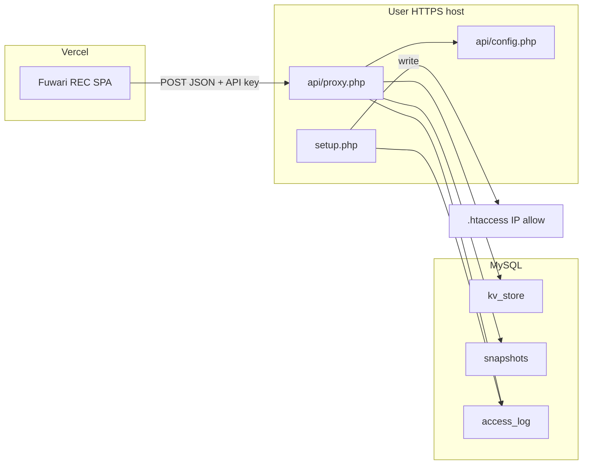

# 計画: Vercel 外部ストレージ

## 問題

Fuwari REC はブラウザ完結のボーカルデスクで、本番は **Vercel** に載せる想定です。

- Vercel のサーバーレスは **永続ディスクも常駐 MySQL も持たない**
- 録音・デコード済みバッファはクライアントメモリ（Web Audio）に置くのが正しい
- それでも **MIX / 声域 / BPM** は端末をまたいで残したい
- 「Vercel から直接ユーザーの MySQL に TCP 接続」は CORS でもなく、認証も危険

## 方針

**ユーザーが用意した HTTPS ホストに、薄い JSON プロキシを置く。**

Vercel 上のフロントは `fetch(proxyUrl)` するだけ。プロキシが PDO で MySQL を触る。  
ブラウザは `SELECT` 文字列を送らない（action 名だけ）。

## レイヤ

1. **HTTPS** — 通信の保護（Basic を使うなら必須）
2. **CORS_ORIGINS** — 許可した Vercel / 独自ドメインだけ
3. **API_KEY** — アプリの本体鍵（`X-Api-Key`）
4. **Basic 認証（任意）** — URL を知っているだけのスキャンを弾くおまじない
5. **IP allowlist（任意）** — `setup.php` が `proxy.php` だけ `Require ip` を書く
6. **namespace** — ユーザー / 端末の論理バケット

## データモデル

- `kv_store` — `(namespace, key) → JSON`。最新設定 `settings.latest` など
- `snapshots` — 名前付き履歴（kind = `settings` など）
- `access_log` — 接続確認・監査（IP / action / origin）
- `ip_allowlist` — setup が .htaccess 生成に使う

音声ファイルは **ここに置かない**。サイズ・著作権・期限の問題を Vercel 側に持ち込まない。

## デプロイ単位

このリポジトリの [`php/`](../php/) が 1 単位。  
Fuwari 本体リポジトリとは切り離し、プロキシだけ差し替え・再配布できるようにする。

## 将来

| やらない | 理由 |
|----------|------|
| 生 SQL エンドポイント | インジェクション面が広すぎる |
| Vercel KV / Blob を必須にする | ユーザー自身の MySQL を使う、がこの計画の核 |
| 音声アップロード | ブラウザ完結を崩す |

やるとしたら: namespace ごとの容量上限、エクスポート ZIP、複数アプリで同じ `config.php` を共有してテーブルだけ足す。
